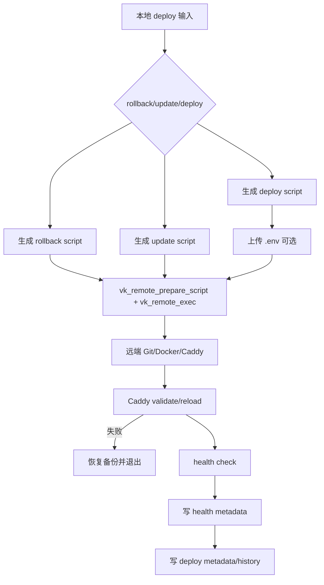

# deploy-reliability-core design

## 0. 术语约定

| 术语 | 定义 | 防冲突结论 |
|---|---|---|
| deploy-reliability | `deploy.sh` 的部署/更新/回滚可靠性核心，覆盖远端执行、Docker、Caddy、健康检查、元数据和历史记录 | roadmap 已定义 |
| deploy health result | 应用本地健康检查结果，字段为 `status/http_code/message`，写入 app 元数据 | roadmap 4.7 已定义 deploy-health-contract |
| deploy type | 应用部署类型，`compose` 或 `dockerfile`，写入 `.deploy-type` | 当前远端脚本只临时检测，不持久化 |
| rollback hint | 更新/部署失败后用户可执行的回滚提示，依赖 `.last-working-commit` | 当前 update 保存 commit，但失败提示不足 |
| deploy remote execution | rollback/update/main deploy 三条远端脚本上传执行链路 | 必须消费 `lib/remote_exec.sh` |

## 1. 决策与约束

### 需求摘要

本 feature 的目标是让应用部署流程不再只凭 Docker 启动或 Caddy reload 表象判断成功，并把关键结果落成可被后续 status/backup/ops 消费的元数据：

- rollback、update、main deploy 三条远端执行链路使用 `vk_remote_prepare_script` / `vk_remote_exec`。
- Caddy 配置失败或 reload 失败必须恢复备份并使 deploy step 失败，不能 `mark_done step_caddy`。
- 健康检查结果写入 `.deploy-health-status`、`.deploy-health-code`、`.deploy-health-message` 和 `.deploy-health-url`。
- main deploy 写入 `.deploy-type`，与 `.deploy-domain/.deploy-port/.deploy-branch` 形成完整 metadata。
- update 前保存 `.last-working-commit`，并在失败 trap 中提示 rollback 入口。
- 健康检查 `000` 或 `5xx` 至少是 warning 并持久化；本 feature 不把 warning 强制改成失败。

明确不做：

- 不把健康检查变成用户可配置 required/optional；required healthcheck 留给后续 feature。
- 不重写全部 deploy 交互输入为 runtime prompt。
- 不改变用户已有 Docker Compose/Dockerfile 部署策略。
- 不改 backup/status/security 的读取逻辑；它们后续通过 ops-flow 消费新 metadata。

### 复杂度档位

- 健壮性 = L3 严防。部署失败会影响线上应用，Caddy 和 Docker 失败不能被吞。
- 结构 = modules。消费 `lib/remote_exec.sh`，不新增根目录 helper。
- 可测试性 = tested。用静态和抽取 fixture 验证 wrapper 接入、Caddy 失败不 mark_done、metadata 和 health 映射。
- 安全性 = validated。placeholder 替换继续通过 `vk_remote_prepare_script`，`.env` 上传仍保持权限和临时文件路径。

### 关键决策

1. 三条远端执行链路全部消费 wrapper。
   - 选择：rollback/update/main deploy 都用 `vk_remote_prepare_script` + `vk_remote_exec`。
   - 拒绝：只改 main deploy。
   - 原因：rollback/update 同样会改代码和容器，失败也需要统一错误码。

2. Caddy 失败是关键失败。
   - 选择：`caddy validate` 或 reload 失败时恢复备份并 `exit` 当前 step。
   - 拒绝：打印 err 后继续 `mark_done step_caddy`。
   - 原因：域名/HTTPS 是部署成功的用户可见结果，不能误报。

3. 健康检查先持久化 warning，不强制失败。
   - 选择：`000/5xx` 写 `warn`，`2xx/3xx` 写 `ok`，`4xx` 写 `warn`。
   - 拒绝：本 feature 直接让所有 `000/5xx` 失败。
   - 原因：roadmap 只要求至少 warning；required healthcheck 需要新用户输入和策略。

4. 元数据按 roadmap 4.7 补齐。
   - 选择：写 `.deploy-type`、`.deploy-health-url/status/code/message`。
   - 拒绝：只在 history 里记录。
   - 原因：status/security/backup 后续需要稳定文件协议。

### 前置依赖

- `remote-exec-wrapper` 已完成，提供远端执行 wrapper。
- `zh-i18n-baseline` 已完成，默认中文和远端语言注入可用。

## 2. 名词与编排

### 2.1 名词层

#### 现状

- `deploy.sh` rollback/update/main deploy 三处仍有 inline `REMOTE_TMP=$(ssh ... mktemp)`、`scp`、`ssh "chmod; sudo bash; rm"`。
- main deploy 只写 `.deploy-domain`、`.deploy-port`、`.deploy-branch`，没有 `.deploy-type` 和健康结果文件。
- health check 只打印 warning/success，不持久化。
- Caddy validate 失败会恢复备份，但随后仍 `mark_done step_caddy`；reload 失败也不退出。
- update 保存 `.last-working-commit`，但失败 trap 没有直接输出 rollback 命令。

#### 变化

本地远端执行封装：

```bash
run_prepared_remote_script "$TMPSCRIPT" "$USERNAME" "$VPS_IP" "$SSH_KEY" true 1800 auto "$MSG_DEPLOY_SCRIPT_SEND_FAILED"
```

该 helper 内部调用：

```bash
vk_remote_prepare_script "$TMPSCRIPT" "__APP_NAME__" "$APP_NAME" ...
vk_remote_exec "$TMPSCRIPT" "$USERNAME" "$VPS_IP" "$SSH_KEY" true 1800 auto
```

部署元数据协议：

```text
~USER/apps/APP/.deploy-domain
~USER/apps/APP/.deploy-port
~USER/apps/APP/.deploy-branch
~USER/apps/APP/.deploy-type
~USER/apps/APP/.deploy-health-url
~USER/apps/APP/.deploy-health-status
~USER/apps/APP/.deploy-health-code
~USER/apps/APP/.deploy-health-message
```

健康检查映射：

```bash
2xx/3xx => status=ok
000     => status=warn, message=not responding
4xx/5xx => status=warn, message=http warning
```

### 2.2 编排层

#### 主流程图



#### 现状

当前 deploy flow 把远端脚本执行、Caddy 配置、健康检查和元数据写入分散处理；多个失败路径只 warning 或 `|| true`，后续仍可能清掉 progress 并打印部署完成。

#### 变化

- 本地三条远端执行链路接入 wrapper。
- main deploy 内新增 `DEPLOY_TYPE` 和 `HEALTH_*` 变量。
- Docker compose 成功后 `DEPLOY_TYPE=compose`；Dockerfile 成功后 `DEPLOY_TYPE=dockerfile`。
- Caddy validate/reload 失败恢复备份后 `exit 34`。
- health check 写 metadata，`000/5xx` 保持 warning 但不清除可诊断信息。
- metadata step 写 `.deploy-type` 和 health 文件。
- deploy trap 输出 rollback command hint。

#### 流程级约束

- 错误语义：Caddy 失败返回 `34`；Docker/Git 关键失败仍非零退出；wrapper 失败透传 `20-25`。
- 幂等性：已有 `.last-working-commit` 在更新前刷新；metadata 覆盖写入。
- 顺序约束：Caddy 成功后才 mark `step_caddy`；health check 后才写 health metadata；最终成功后才删除 progress。
- 可观测点：metadata 文件和 history 记录可被 status/ops 后续读取。
- 扩展点：required healthcheck 后续可读取同一 metadata 文件并升级 warn 为 failed。

### 2.3 挂载点清单

- `deploy.sh` shared lib 加载点：删掉后无法消费 wrapper。
- `deploy.sh` 三条远端执行 helper 调用：删掉后 rollback/update/main deploy 回到旧错误语义。
- main deploy 远端 Caddy step：删掉后 Caddy 失败可能误报成功。
- main deploy health metadata 写入：删掉后 deploy-health-contract 不存在。
- `tests/test_deploy_reliability.sh`：删掉后无法验证本 feature 的可靠性契约。

### 2.4 推进策略

1. 本地远端执行接入：新增 deploy shared lib loading 和 wrapper helper，替换 rollback/update/main deploy inline 远端执行。
   - 退出信号：grep 不再命中 deploy 旧组合式远端执行行，三处都命中 `vk_remote_exec`。
2. Caddy 关键失败节点：validate/reload 失败恢复备份并退出，不 mark_done。
   - 退出信号：抽取远端 deploy script fixture 验证 Caddy reload 失败块包含 `exit 34` 且 `mark_done step_caddy` 在成功路径之后。
3. 健康检查与 metadata 节点：写 deploy type 和 health metadata。
   - 退出信号：fixture/grep 验证 `.deploy-type`、`.deploy-health-*` 写入和 `000/5xx` warning 映射。
4. rollback/update 提示节点：失败 trap 输出 rollback 命令提示，update 保留 last-working commit。
   - 退出信号：grep 验证 trap 输出 rollback 提示且 update 保存 `.last-working-commit`。
5. 验收覆盖：新增 deploy reliability 测试并跑既有测试。
   - 退出信号：新增测试、既有测试、全量 `bash -n` 和 YAML 校验通过。

### 2.5 结构健康度与微重构

##### 评估

- 文件级 — `deploy.sh`：约 1700 行，明显偏胖，且 heredoc 内含 rollback/update/main deploy 三个子流程。
- 文件级 — `lang.sh`：本 feature 不改语言文件结构。
- 目录级 — `lib/`：已有 shared runtime/remote_exec；本 feature 不新增新模块。
- compound convention 检索：`.codestable/compound` 暂无目录/命名约定类文档。

##### 结论：不做微重构

本次不拆 `deploy.sh`。原因：当前目标是可靠性契约和部署行为修正，拆分 heredoc 会改变 curl-mode 分发形态，风险高且会和可靠性变更混在一起。

##### 超出范围的观察

- `deploy.sh` 本地交互仍大量 `read -p`，后续可单独迁移到 runtime input helper。
- required healthcheck 需要新增用户选择/配置，不在本 feature 中引入。

## 3. 验收契约

- S1：rollback、update、main deploy 三条远端执行都使用 `vk_remote_prepare_script` / `vk_remote_exec`。
- S2：`deploy.sh` 不再保留旧组合式 `chmod 700; sudo bash; rm -f` 执行行。
- S3：Caddy validate/reload 失败恢复备份并退出，不写 `step_caddy` done。
- S4：健康检查 `000`、`2xx/3xx`、`4xx/5xx` 映射到持久化 health status/code/message。
- S5：main deploy 写 `.deploy-type`，值为 `compose` 或 `dockerfile`。
- S6：metadata 写 `.deploy-health-url/status/code/message`。
- S7：update 前保存 `.last-working-commit`，失败 trap 输出 rollback 命令提示。
- S8：本 feature 不改变 Docker Compose/Dockerfile 部署策略，不引入 required healthcheck。

## 4. 与项目级架构文档的关系

验收时需要更新 `.codestable/architecture/ARCHITECTURE.md`：

- `deploy.sh` 模块描述补充：已消费 `lib/remote_exec.sh`。
- Core concepts / Known constraints 补充 deploy health metadata 文件协议。
- Known constraints 补充 Caddy validate/reload 失败必须恢复备份并失败。
