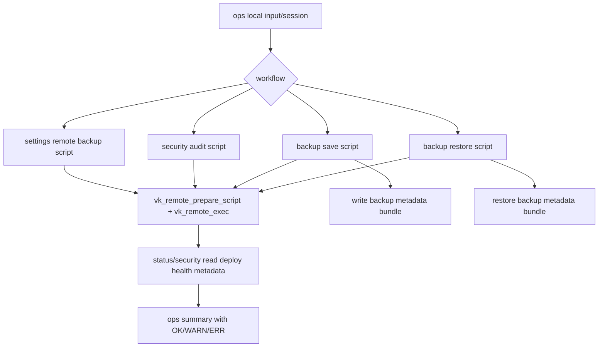

# ops-flow-reliability design

## 0. 术语约定

| 术语 | 定义 | 防冲突结论 |
|---|---|---|
| ops-flow | `backup.sh`、`status.sh`、`security.sh`、`settings.sh` 中面向运维的备份、恢复、状态、安全审计和远程备份配置流程 | roadmap 已定义 |
| backup metadata bundle | 备份归档中携带的 app metadata 文件集合，包括旧的 domain/port 和新 deploy health/type 文件 | 扩展现有 backup metadata |
| ops remote execution | ops 脚本生成远端 heredoc 后上传执行的链路 | 必须消费 `lib/remote_exec.sh` |
| deploy health consumer | 读取 `.deploy-health-*` 并在 status/security/backup 中展示或携带的节点 | 消费 deploy-reliability-contract |
| degraded ops result | 操作主体成功但某个可降级节点失败，最终摘要必须用 warning 表达 | 来自 runtime step 契约 |

## 1. 决策与约束

### 需求摘要

本 feature 聚焦 deploy 之后的运维流程可靠性：

- `backup.sh` restore 和 backup 两条远端执行链路接入 `vk_remote_prepare_script` / `vk_remote_exec`。
- `security.sh` 远端审计脚本接入 wrapper。
- `settings.sh` 远程备份的 rclone 配置和 cron 更新远端脚本接入 wrapper。
- `status.sh` 消费 `.deploy-type` 和 `.deploy-health-url/status/code/message`，把部署健康状态展示给用户。
- `backup.sh` 和 settings 生成的 cron backup 都携带 `.deploy-type`、`.deploy-branch`、`.deploy-health-*`，restore 时恢复这些 metadata。
- 可降级动作保留 warning，但必须能被测试证明不会误报为完全成功；关键远端执行失败必须返回 wrapper 阶段码。

明确不做：

- 不重写所有 `read -p` 为 runtime prompt；交互统一留给后续独立 feature。
- 不把数据库 dump 失败升级成备份失败；当前策略仍是 warning + volume fallback。
- 不改变备份归档格式的主入口和用户命令。
- 不新增真实 S3/VPS 集成测试硬依赖。
- 不重写 `settings.sh` 的远程备份 wizard 结构。

### 复杂度档位

- 健壮性 = L3 严防。backup/restore/security/settings 会修改或读取生产数据，远端脚本执行失败不能被吞。
- 结构 = modules。继续消费 `lib/remote_exec.sh`，不新建第二套 wrapper。
- 可测试性 = tested。新增 ops 静态/fixture 测试，抽取 heredoc 验证 metadata 与执行出口。
- 安全性 = validated。placeholder 替换走 wrapper；额外 tarball/backup 文件 `scp` 仍保留但加超时和失败处理。

### 关键决策

1. ops 远端脚本全部消费同一 wrapper。
   - 选择：backup restore、backup save、security audit、settings rclone、settings cron update 都使用 `vk_remote_prepare_script` / `vk_remote_exec`。
   - 拒绝：只修 backup 主流程。
   - 原因：这些路径都是远端脚本生成/上传/执行，错误语义应一致。

2. backup metadata 向前兼容扩展。
   - 选择：新增可选 metadata 文件，不改变旧 `deploy-domain` / `deploy-port` 名称。
   - 拒绝：把 metadata 全部迁到单 JSON。
   - 原因：restore 已按文件名恢复，单 JSON 会扩大兼容风险。

3. deploy health 在 status/security 中只展示/提示，不升级失败。
   - 选择：`ok` 显示 OK，`warn/failed` 显示 WARN/ERR 或审计项。
   - 拒绝：ops-flow 直接要求健康检查失败中断 status/security。
   - 原因：deploy feature 明确 required healthcheck 不在当前路线中。

4. 保留数据库 dump warning 语义。
   - 选择：dump 失败仍 warning，但测试要证明 warning 文案存在且归档继续。
   - 拒绝：强制 dump 失败导致整次 backup 失败。
   - 原因：现有产品行为依赖 volume fallback。

## 2. 名词与编排

### 2.1 名词层

#### 现状

- `backup.sh` restore 和 save 都有 inline `REMOTE_TMP=$(ssh ... mktemp)`、`scp`、`ssh "chmod 700; sudo bash; rm -f"`。
- `security.sh` 同样保留 inline 远端执行块。
- `settings.sh` 的 `_update_cron_retention` 和完整 rclone 配置各自手写远端执行。
- `status.sh` 已消费 wrapper，但只读 `.deploy-domain`、`.deploy-port` 和 Git/Docker 状态，不读 deploy health metadata。
- backup 归档只携带 `.deploy-domain` / `.deploy-port`，restore 也只恢复这两项。

#### 变化

Ops 远端执行 helper：

```bash
run_prepared_remote_script "$TMPSCRIPT" "$ssh_user" "$host" "$ssh_key" "$failure_message" "__USERNAME__" "$USERNAME" ...
```

该 helper 内部统一调用：

```bash
vk_remote_prepare_script "$TMPSCRIPT" "__PLACEHOLDER__" "$value" ...
vk_remote_exec "$TMPSCRIPT" "$ssh_user" "$host" "$ssh_key" true timeout auto
```

Backup metadata bundle 保持文件式协议：

```text
deploy-domain
deploy-port
deploy-branch
deploy-type
deploy-health-url
deploy-health-status
deploy-health-code
deploy-health-message
metadata.json
```

Status/security deploy health consumer：

```text
status=ok     -> [OK] / green line
status=warn   -> [WARN] / yellow line
status=failed -> [ERR] / red line
missing       -> absent or info, not failure
```

### 2.2 编排层



#### 现状

各 ops flow 的远端执行、placeholder 替换、上传和清理散落在脚本尾部或 settings 函数内部。backup/status/security 对 deploy metadata 的理解不一致：status/security 只看 domain/port，backup 只保存旧 metadata，导致 deploy-reliability 生成的新 health/type 信息无法被后续运维消费。

#### 变化

- `backup.sh` / `security.sh` / `settings.sh` 加载 `lib/runtime.sh` 和 `lib/remote_exec.sh`。
- `backup.sh` restore tarball 上传保留 raw `scp`，但加 `BatchMode=yes`、`ConnectTimeout=10` 和失败退出。
- `backup.sh` 两个远端 heredoc 都通过 wrapper 处理语言注入、placeholder 和执行。
- `settings.sh` 的 rclone 配置脚本和 cron 更新脚本通过 wrapper 执行；远端执行失败不打印成功摘要。
- `status.sh` 远端脚本读取 `.deploy-type` 和 health metadata 并输出 health 行。
- `security.sh` 审计读取 deploy health metadata，将 `warn/failed` 计入审计 warning/error。
- backup save 和 settings cron backup 都复制 deploy health/type/branch metadata；restore 恢复存在的 metadata 文件。

#### 流程级约束

- 远端执行失败返回 wrapper 阶段码 `20-25`，调用方必须退出或 return 非零，不能继续打印成功。
- 额外文件上传失败，如 restore tarball、local backup file retrieval，必须显式报错并返回非零；远端临时脚本仍由 wrapper 清理。
- metadata 文件缺失不是错误，兼容旧部署和旧备份。
- `deploy-health-status=warn` 不阻断 status/security，但必须可见。
- S3/rclone 连接失败仍是 warning/错误提示，不删除本地 S3 配置文件。

### 2.3 挂载点清单

- ops shared lib loading：删掉后 backup/security/settings 无法消费 wrapper。
- backup/restore remote execution helper：删掉后 backup 回到旧远端执行错误语义。
- settings remote backup execution helper：删掉后 rclone/cron 配置失败可能误报成功。
- deploy health metadata consumer：删掉后 deploy-reliability 产出的 health/type 对 ops 不可见。
- backup metadata bundle 扩展：删掉后 backup/restore 无法携带 deploy health/type。
- `tests/test_ops_flow_reliability.sh`：删掉后缺少本 feature 的静态契约验证。

### 2.4 推进策略

1. 远端执行接入节点：backup/security/settings 加载 shared libs，并替换 inline 远端执行块。
   - 退出信号：grep 不再命中这些脚本的旧组合式执行行，wrapper 调用数量符合预期。
2. Backup metadata 节点：backup save/restore/cron backup 携带并恢复 deploy health/type/branch metadata。
   - 退出信号：fixture/grep 验证 `deploy-health-*` 和 `deploy-type` 在 save/restore/cron 三处出现。
3. Status/security consumer 节点：读取 health metadata 并渲染 OK/WARN/ERR。
   - 退出信号：抽取 heredoc 验证 status/security 存在 health status 映射。
4. 额外上传和成功摘要节点：restore tarball 与 local backup retrieval 有失败处理，settings 远端配置失败不打印成功。
   - 退出信号：grep 验证 `scp` 带 BatchMode/ConnectTimeout，settings wrapper 失败 return 非零。
5. 验收覆盖节点：新增 ops flow 测试并跑既有 deploy/setup/remote/runtime/i18n 测试。
   - 退出信号：新增测试、既有测试、全量 bash -n 和 YAML 校验通过。

### 2.5 结构健康度与微重构

##### 评估

- 文件级 — `backup.sh`：约 800 行，职责包含交互、restore、backup、S3、文件下载，偏胖。
- 文件级 — `settings.sh`：超过 1200 行，职责明显混杂；远程备份只是其中一个子流程。
- 文件级 — `security.sh`：约 550 行，远端审计脚本集中，远端执行块清晰。
- 文件级 — `status.sh`：已接入 wrapper，本 feature 只补 metadata 展示。
- 目录级 — `lib/` 已有 runtime/remote_exec，不需要新增目录。
- compound convention 检索：未发现目录组织/文件归属约定。

##### 结论：不做微重构

本 feature 不拆 `backup.sh` 或 `settings.sh`。原因：当前目标是远端执行和 metadata 契约收敛，拆文件会扩大 curl-mode 分发和远端 heredoc 风险。只在现有脚本内替换独立远端执行块和 metadata 节点。

##### 超出范围的观察

- `settings.sh` 适合后续按 settings 子功能拆文件。
- `backup.sh` 可后续把 backup/restore 远端 heredoc 拆成模板资源，但需要独立 refactor。
- 交互循环仍有大量 `read -p`，后续应按 runtime input contract 独立推进。

## 3. 验收契约

- S1：`backup.sh` restore/save 远端脚本执行都使用 `vk_remote_prepare_script` / `vk_remote_exec`。
- S2：`security.sh` 远端审计执行使用 wrapper，旧组合式执行行不存在。
- S3：`settings.sh` rclone 配置和 cron 更新远端执行使用 wrapper，失败不打印成功完成。
- S4：`backup.sh` save、restore 和 settings cron backup 携带或恢复 `.deploy-type`、`.deploy-branch`、`.deploy-health-*`。
- S5：`status.sh` 展示 deploy type 和 health status/code/message。
- S6：`security.sh` 把 deploy health warn/failed 纳入审计输出。
- S7：restore tarball 上传和本地 backup 下载使用 `BatchMode=yes`、`ConnectTimeout=10` 并检查失败。
- S8：本 feature 不改变数据库 dump warning + volume fallback 策略，不引入真实 S3/VPS 测试硬依赖。

## 4. 与项目级架构文档的关系

验收时需要更新 `.codestable/architecture/ARCHITECTURE.md`：

- `backup.sh`、`security.sh`、`settings.sh` 模块描述补充消费 `lib/remote_exec.sh`。
- Core concepts / Known constraints 补充 backup metadata bundle 包含 deploy health/type。
- Known constraints 补充 status/security 消费 deploy health metadata 但不把 warn 作为阻断。
