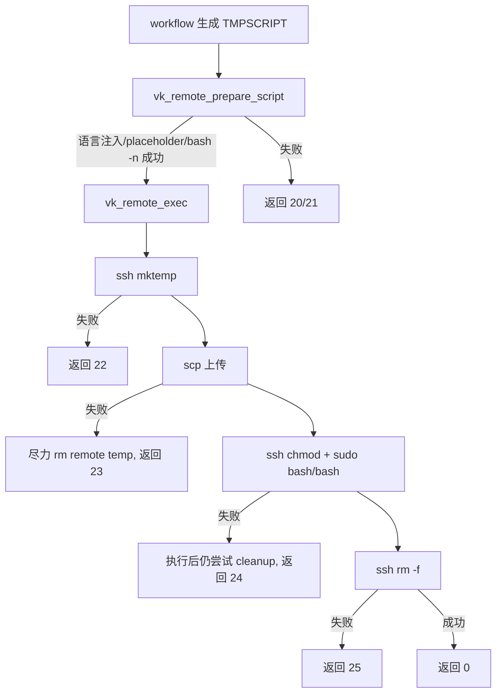

# remote-exec-wrapper design

## 0. 术语约定

| 术语 | 定义 | 防冲突结论 |
|---|---|---|
| remote-exec | 本地生成脚本后，通过 `ssh/scp` 上传、授权、执行并清理远端临时文件的共享链路 | 当前代码只有重复 inline 块，没有同名共享模块 |
| prepared script | 已完成语言注入、placeholder 替换并通过 `bash -n` 的本地临时脚本 | 当前各 workflow 用 `TMPSCRIPT` 表示 |
| placeholder | 远端脚本中的 `__NAME__` 模板占位符，替换值必须经过 sed 安全转义 | 当前已在多脚本里重复 `sed_escape` |
| remote temp | 远端通过 `mktemp /tmp/vps-XXXXXXXXXX.sh` 创建的脚本路径 | 当前所有 workflow 基本一致 |
| cleanup failure | 主执行成功后，远端 `rm -f` 失败的可诊断失败，返回 `25`，但不能掩盖主执行失败 | 当前一行 `chmod; sudo bash; rm` 可能用清理结果掩盖执行结果 |

## 1. 决策与约束

### 需求摘要

本 feature 的目标是收敛重复远端执行逻辑，先解决远端链路里最容易导致“异常无法检测、失败无法返回”的问题：

- 远端 `mktemp`、`scp`、`chmod`、`sudo bash` 和 `rm -f` 每个阶段都有明确返回码。
- 上传和执行失败不能被后续清理动作覆盖。
- 所有 `ssh/scp` 调用带 `BatchMode=yes`、连接超时和可用时的总体超时包装。
- placeholder 替换和语言注入有统一入口，替换失败返回 `21`。
- 第一批只接入 `status.sh`，作为低风险验证点；其他 workflow 后续在 hardening/deploy/ops feature 中逐步消费。

明确不做：

- 不一次性替换 `setup.sh`、`deploy.sh`、`backup.sh`、`security.sh`、`settings.sh` 的全部远端执行块。
- 不改变远端 status 脚本检查内容和输出结构。
- 不处理额外文件上传场景，例如 deploy 的 `.env` 上传和 backup 的 restore tarball 上传。
- 不引入真实 VPS 集成测试作为本 feature 必需前置；用 fake `ssh/scp` fixture 验证契约。

### 复杂度档位

- 健壮性 = L3 严防。远端链路失败会直接影响服务器配置和部署结果，不能吞错。
- 结构 = modules。沿用 runtime feature 建立的 `lib/` 共享模块目录。
- 可测试性 = tested。通过 fake `ssh/scp` 覆盖成功、mktemp 失败、上传失败、执行失败和清理失败。
- 安全性 = validated。远端临时脚本权限固定为 `700`，placeholder 替换统一走 sed 转义，SSH 使用 BatchMode 和连接超时。

### 关键决策

1. 新增共享模块而不是继续复制远端执行代码。
   - 选择：新增 `lib/remote_exec.sh`，由 workflow 脚本 source。
   - 拒绝：只在 `status.sh` 内局部修复。
   - 原因：后续 setup/deploy/backup/security/settings 都要消费同一远端执行契约。

2. 执行和清理拆成两个远端命令。
   - 选择：先执行 `chmod && sudo bash/bash`，再单独 `rm -f`。
   - 拒绝：继续使用 `chmod; sudo bash; rm -f` 一行命令。
   - 原因：一行命令会让最后的 `rm` 结果掩盖真正的执行失败。

3. 第一批只接入 `status.sh`。
   - 选择：`status.sh` 用 `vk_remote_prepare_script` + `vk_remote_exec` 替换原 inline 块。
   - 拒绝：本 feature 内批量改所有 workflow。
   - 原因：远端链路是高风险路径，先用只读状态检查闭环验证 wrapper，再让后续 workflow feature 扩面。

4. timeout 采用兼容策略。
   - 选择：所有 `ssh/scp` 都带 `ConnectTimeout`；本机存在 `timeout` 或 `gtimeout` 时再包总体超时。
   - 拒绝：强依赖 GNU `timeout`。
   - 原因：vpskit 支持 macOS，本地环境不一定有 GNU coreutils。

### 前置依赖

- `runtime-core-contracts` 已完成，提供 `lib/` 目录、错误码基础和 runtime 诊断输出。

## 2. 名词与编排

### 2.1 名词层

#### 现状

- `status.sh`、`security.sh`、`setup.sh`、`backup.sh`、`deploy.sh` 和 `settings.sh` 都重复实现远端执行块。
- 典型流程是 `inject_lang_into_remote "$TMPSCRIPT"`、手写 `sed -i` 替换、`ssh mktemp`、`scp`、`ssh "chmod 700; sudo bash; rm -f"`。
- 多数路径只检查 `scp`，没有区分 `mktemp`、`chmod`、远端执行和清理失败。
- `ssh` 执行阶段通常没有 `BatchMode=yes` 和 `ConnectTimeout`，也没有总体超时包装。
- `lib/runtime.sh` 当前没有 `20-25` 远端执行错误码常量和 code name。

#### 变化

新增 `remote-exec` 对外契约，落在 `lib/remote_exec.sh`：

```bash
# 语言注入、placeholder 替换和语法校验。
# 返回:
#   0  = prepared script 可上传
#   20 = 本地脚本缺失、为空、语言注入失败或语法失败
#   21 = placeholder 参数或 sed 替换失败
vk_remote_prepare_script script_path [placeholder value]...

# 单个 placeholder 安全替换。
# 返回:
#   0  = 替换成功
#   21 = 替换失败
vk_remote_replace_placeholder script_path placeholder value

# 上传并执行 prepared script。
# 返回:
#   0  = 远端脚本成功
#   20 = 本地脚本不可用
#   22 = 远端 mktemp 失败
#   23 = scp 上传失败
#   24 = chmod 或远端脚本执行失败
#   25 = 远端清理失败，但主执行成功
vk_remote_exec script_path ssh_user host ssh_key sudo_mode timeout_seconds [tty_mode]
```

接口示例：

```bash
if ! vk_remote_prepare_script "$TMPSCRIPT" "__USERNAME__" "$USERNAME"; then
    code=$?
    err "$(printf 'remote script preparation failed: %s' "$code")"
    exit "$code"
fi

info "$MSG_STATUS_SENDING"
if vk_remote_exec "$TMPSCRIPT" "$USERNAME" "$VPS_IP" "$SSH_KEY" true 900 auto; then
    rm -f "$TMPSCRIPT"
else
    code=$?
    rm -f "$TMPSCRIPT"
    exit "$code"
fi
```

`lib/runtime.sh` 同步补齐错误码常量和 code name：

```bash
VK_REMOTE_GENERATE_FAILED=20
VK_REMOTE_PLACEHOLDER_FAILED=21
VK_REMOTE_MKTEMP_FAILED=22
VK_REMOTE_UPLOAD_FAILED=23
VK_REMOTE_EXECUTE_FAILED=24
VK_REMOTE_CLEANUP_FAILED=25
```

### 2.2 编排层

#### 主流程图



#### 现状

当前 `status.sh` 的远端执行是线性 inline 块：

- 语言注入和 placeholder 替换直接操作 `TMPSCRIPT`。
- `ssh mktemp` 未检查返回码。
- `scp` 失败时返回 `1`，无法区分上传失败和其他网络失败。
- `ssh "chmod 700; sudo bash; rm -f"` 用最后一条命令作为整体结果，存在掩盖主执行失败的风险。

#### 变化

- `status.sh` 加载 `lib/runtime.sh` 和 `lib/remote_exec.sh`。
- `status.sh` 使用 `vk_remote_prepare_script` 处理语言注入、`__USERNAME__` 替换和语法检查。
- `status.sh` 使用 `vk_remote_exec` 替代 inline 上传/执行/清理块。
- `vk_remote_exec` 内部将 `mktemp`、`scp`、执行和清理拆成独立阶段，按阶段返回 `20-25`。
- `vk_remote_exec` 不删除本地 `TMPSCRIPT`；本地临时文件仍由调用方和既有 EXIT trap 管理。

#### 流程级约束

- 错误语义：本地准备失败返回 `20/21`，远端阶段失败返回 `22/23/24/25`。
- 幂等性：每次执行都新建远端临时脚本；上传失败或执行失败后尽力清理远端临时文件。
- 顺序约束：必须先 prepare，再 exec；未通过 prepare 的脚本不得上传。
- 可观测点：失败路径输出 `[ERR] code=<code> name=<code_name> step=remote_exec message=<phase>`。
- 扩展点：后续 workflow 可继续使用自己的脚本生成逻辑，只替换 prepare/exec 阶段；额外文件上传另起契约。

### 2.3 挂载点清单

- `lib/remote_exec.sh` 公共函数入口：删掉后远端执行 wrapper 不存在。
- `lib/runtime.sh` 远端错误码补充：删掉后 `20-25` 无法输出稳定 code name。
- `status.sh` 加载点：source `lib/remote_exec.sh`；删掉后 status workflow 回到旧 inline 远端执行。
- `status.sh` 远端执行块：替换 `ssh mktemp/scp/ssh chmod...` 为 wrapper 调用；删掉后本 feature 的端到端验证消失。
- `tests/test_remote_exec.sh` fake `ssh/scp` fixture：删掉后无法证明远端错误码契约。

### 2.4 推进策略

1. 编排骨架：新增 `lib/remote_exec.sh` 并补齐 runtime 远端错误码。
   - 退出信号：`bash -n lib/runtime.sh lib/remote_exec.sh` 通过。
2. 准备节点：实现 `vk_remote_prepare_script` 和 placeholder 安全替换。
   - 退出信号：特殊字符 placeholder 替换后脚本仍通过 `bash -n`。
3. 远端执行节点：实现 `vk_remote_exec` 的 mktemp、upload、execute、cleanup 分阶段返回码。
   - 退出信号：fake `ssh/scp` 可分别触发 `22/23/24/25`。
4. status 接入：将 `status.sh` 的远端执行块切到 wrapper。
   - 退出信号：`status.sh` 不再直接调用 `REMOTE_TMP=$(ssh ... mktemp)` 和组合式 `sudo bash; rm -f`。
5. 验收覆盖：新增 remote-exec 行为测试并跑现有 runtime/i18n 测试。
   - 退出信号：remote-exec 测试、runtime 测试、i18n 测试和 Bash 语法检查通过。

### 2.5 结构健康度与微重构

##### 评估

- 文件级 — `status.sh`：当前约 400 行，远端执行块清晰独立；本次替换范围小，不需要先拆文件。
- 文件级 — `lib/runtime.sh`：只追加远端错误码常量和 code name，不改变已有 runtime API。
- 目录级 — `lib/`：已经由 runtime feature 建立，适合承载共享 Bash 模块；新增 `remote_exec.sh` 不扩大根目录摊平。
- compound convention 检索：`.codestable/compound` 暂无目录/命名约定类文档。

##### 结论：不做微重构

本次只新增共享模块并替换 `status.sh` 的单个远端执行块。`setup.sh`、`deploy.sh` 等大文件确实偏胖，但批量拆分或重组会超出本 feature 的最小验证范围，留给后续 hardening/deploy/ops feature 分别处理。

##### 超出范围的观察

- `deploy.sh` 中 `.env` 上传、GitHub SSH、rollback/update/deploy 三条远端路径需要后续 `deploy-reliability-core` 单独收敛。
- `settings.sh` 有两个远端配置写入块，后续适合由 `ops-flow-reliability` 接入 wrapper。

## 3. 验收契约

- S1：本地脚本不存在或为空 → `vk_remote_exec` 返回 `20`，并输出 remote generate 诊断。
- S2：placeholder 值包含 `\`、`&`、`|` 等 sed 特殊字符 → `vk_remote_prepare_script` 替换成功，脚本语法仍有效。
- S3：远端 `mktemp` 失败 → `vk_remote_exec` 返回 `22`，不继续上传。
- S4：`scp` 上传失败 → `vk_remote_exec` 返回 `23`，并尝试清理已经创建的远端临时文件。
- S5：`chmod` 或远端脚本执行失败 → `vk_remote_exec` 返回 `24`，且仍尝试清理远端临时文件。
- S6：主执行成功但远端清理失败 → `vk_remote_exec` 返回 `25`。
- S7：成功路径 → fake `ssh/scp` 日志显示 `BatchMode=yes`、`ConnectTimeout`、`mktemp /tmp/vps-XXXXXXXXXX.sh`、`chmod 700`、`sudo bash` 和 `rm -f`。
- S8：`status.sh` 通过 wrapper 发送和执行远端脚本，且不再保留旧组合式 `sudo bash ...; rm -f` 执行行。

反向核对项：

- 不批量替换 `setup.sh`、`deploy.sh`、`backup.sh`、`security.sh`、`settings.sh` 的远端执行块。
- 不改变 status 远端脚本采集哪些信息。
- 不新增真实 VPS 集成测试硬依赖。

## 4. 与项目级架构文档的关系

验收时需要更新 `.codestable/architecture/ARCHITECTURE.md`：

- 在核心概念中补充 remote-exec 共享模块已经落地。
- 在模块索引中加入 `lib/remote_exec.sh`。
- 在已知约束中写入远端执行分阶段返回码、清理不能掩盖主执行失败、`ssh/scp` 必须 BatchMode + ConnectTimeout。
