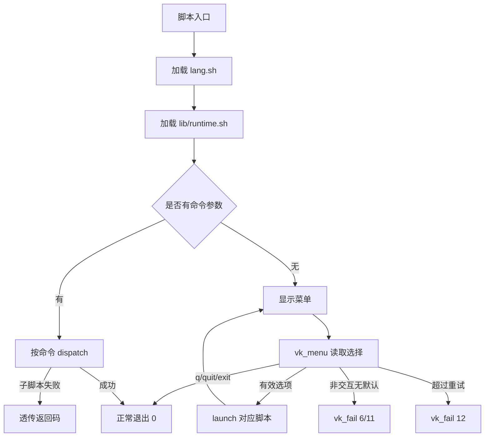

# runtime-core-contracts design

## 0. 术语约定

| 术语 | 定义 | 防冲突结论 |
|---|---|---|
| runtime-core | 新增的 Bash 共享运行时模块，承载输入、菜单、命令执行、错误码、步骤状态和清理协议 | 代码里当前没有同名模块；`runtime` 一词仅作为本 feature 的共享层命名 |
| prompt | 一次可校验的输入读取，必须支持默认值、非交互行为、退出和重试上限 | 当前大量 `read -p` 分散在各脚本，没有统一抽象 |
| menu | 一组选项的 prompt，必须显式支持返回/退出，不允许只有 `while true` + 无效输入继续循环 | 当前 `vpskit.sh` 和 `settings.sh` 都是 `while true` 菜单 |
| step | 一个 workflow 中可恢复/可诊断的阶段，写入进度文件或摘要 | 当前 `setup.sh` / `deploy.sh` 已有 step 概念，但格式不统一 |
| degraded | 非关键动作失败但主流程可继续，必须在摘要中显示 warning | 当前部分 `|| true` 是合理降级，部分会吞掉关键失败 |

## 1. 决策与约束

### 需求摘要

本 feature 的用户目标是先解决 vpskit 流程中最基础的稳定性问题：菜单不能死循环，
异常要能检测并返回，非交互模式不能卡在 `read`，关键失败要有约定错误码和可观察输出。

成功标准：

- 顶层菜单至少支持 `q`/`quit`/`exit` 退出，错误输入有重试上限。
- 非交互调用遇到缺失输入时返回约定错误码，不阻塞等待。
- 关键失败通过统一错误码和 `vk_fail` 输出，调用方能判断原因。
- 新的 step 状态协议可记录 `started/done/skipped/failed/degraded`。
- 最小接入面覆盖 `vpskit.sh` 菜单和共享 runtime 自测；其他脚本后续 feature 再逐步接入。

明确不做：

- 不在本 feature 中重写 `setup.sh` / `deploy.sh` 的完整流程。
- 不在本 feature 中实现中文语言包；中文化由 `zh-i18n-baseline` 负责。
- 不在本 feature 中抽远端执行包装；远端执行由 `remote-exec-wrapper` 负责。
- 不把所有 `read -p` 一次性替换完；本 feature 只建立契约和最小闭环。

### 复杂度档位

- 健壮性 = L3 严防（偏离内部工具默认 L2；原因：用户明确指出异常无法检测/无法返回，且本模块会成为所有 workflow 的错误处理基础）。
- 结构 = modules（偏离内部工具默认 functions；原因：根目录已有 8 个顶层 Bash 脚本，多个脚本超过 500 行，共享逻辑继续 inline 会加重膨胀）。
- 可测试性 = tested（偏离内部工具默认 testable；原因：本 feature 的成功标准就是循环退出、非交互和错误返回，必须有可执行测试证明）。
- 安全性 = validated（显式采用内部工具默认可信边界以上的输入校验；原因：prompt 和命令包装会接触用户输入与 shell 命令）。

### 关键决策

1. 新增共享模块而不是继续复制函数到各脚本。
   - 选择：新增 `lib/runtime.sh` 作为 runtime-core 入口。
   - 拒绝：把 `vk_prompt` / `vk_menu` 写进 `vpskit.sh`。
   - 原因：后续 `setup.sh`、`deploy.sh`、`settings.sh` 都要复用同一契约。

2. 先改最小接入面，不一次性改全仓库。
   - 选择：本 feature 接入 `vpskit.sh` 顶层菜单，保留其他脚本的旧输入逻辑。
   - 拒绝：本 feature 同时替换全部 `read -p`。
   - 原因：全部替换会牵动 setup/deploy/backup/security/settings 的业务流程，超出最小闭环。

3. 错误码采用数字 + 文本 code 双层语义。
   - 选择：函数返回数字码，输出中包含文本 code 和 step_id。
   - 拒绝：只用 Bash 退出码，不输出文本上下文。
   - 原因：Bash 退出码适合机器判断，文本 code 适合用户和日志诊断。

### 前置依赖

无。该条是 roadmap 的最小闭环，`depends_on: []`。

## 2. 名词与编排

### 2.1 名词层

#### 现状

- `vpskit.sh` 定义 `info/success/warn/err`、`run_script`、`run_local`、`launch` 和 `main`。顶层菜单在 `main` 中使用 `while true` 和 `read -p`，只支持 `7` 退出，不支持 `q/quit/exit`，无重试上限。
- `settings.sh` 也有 `while true` 主菜单，同样用 `read -p`，只支持编号退出。
- `lang.sh` 的 `choose_language` 直接 `read -p`，非交互时由 `load_lang` 判断 `[ -t 0 ]` 后 fallback 到法语。
- `setup.sh` 和 `deploy.sh` 已有 step/progress 概念，但 `setup.sh` 只写 `step1` 这样的完成标记，`deploy.sh` 使用 `.deploy-progress` 保存完成 step，缺少失败/degraded 事件。

#### 变化

新增 `runtime-core` 对外契约，后续实现建议落在 `lib/runtime.sh`：

```bash
# 来源：roadmap 4.1
vk_prompt result_var prompt default validator max_attempts
vk_confirm prompt default max_attempts
vk_menu result_var prompt options default max_attempts

# 来源：roadmap 4.2
vk_run step_id severity timeout_seconds command...
vk_degrade step_id severity message
vk_fail code step_id message

# 来源：roadmap 4.3
vk_step_start progress_file step_id message
vk_step_done progress_file step_id message
vk_step_skip progress_file step_id message
vk_step_fail progress_file step_id code message
vk_step_degrade progress_file step_id code message
vk_step_is_done progress_file step_id
```

接口示例：

```bash
# 顶层菜单读取
if vk_menu choice "$MSG_VPSKIT_CHOICE_PROMPT" "1,2,3,4,5,6,7,q" "" 3; then
    case "$choice" in
        q|quit|exit|7) vk_fail 0 main "$MSG_VPSKIT_BYE" ;;
        1) launch "setup.sh" ;;
    esac
else
    code=$?
    vk_fail "$code" main "$MSG_VPSKIT_INVALID_CHOICE"
fi

# 非交互缺输入
if ! vk_prompt repo_url "$MSG_DEPLOY_REPO_URL_PROMPT" "" "non_empty" 3; then
    code=$?
    vk_fail "$code" deploy_input "$MSG_DEPLOY_REPO_URL_REQUIRED"
fi

# step 事件
vk_step_start "$PROGRESS_FILE" "step_docker" "Build Docker image"
if vk_run "step_docker" required 600 docker compose up -d --build; then
    vk_step_done "$PROGRESS_FILE" "step_docker" "Docker started"
else
    code=$?
    vk_step_fail "$PROGRESS_FILE" "step_docker" "$code" "Docker build failed"
    return "$code"
fi
```

### 2.2 编排层

#### 主流程图



#### 现状

当前主流程是线性入口 + 菜单循环：

- `vpskit.sh main` 有参数时直接 `launch` 子脚本，无参数时进入无限菜单循环。
- `launch` 不显式处理子脚本返回码，依赖 `set -euo pipefail` 让失败中断。
- 菜单无效输入只 warning 后继续循环，没有重试计数。
- `run_script` / `run_local` 返回 `1`，但没有统一错误码语义。

#### 变化

- 在脚本启动时加载 runtime-core。
- 顶层菜单改用 `vk_menu`，支持退出别名、重试上限、非交互错误返回。
- `launch` 保留当前职责，但失败返回通过 `vk_fail` 或调用方返回码透出。
- runtime-core 提供 step 事件函数，但本 feature 只实现并自测，不要求 setup/deploy 立即改写。
- 保留 `set -euo pipefail`，但关键命令执行要逐步迁移到 `vk_run`，避免静默失败或不可解释退出。

#### 流程级约束

- 错误语义：`vk_prompt/vk_menu` 返回 roadmap 定义的 `10/11/12`；`vk_fail` 输出 code、step_id、message。
- 幂等性：`vk_step_done` 重复写入同一 step 时，`vk_step_is_done` 以最后一个 `done` 或兼容旧标记为准；本 feature 不删除旧进度文件格式。
- 顺序约束：先加载语言，再加载 runtime；runtime 不依赖具体 workflow 脚本，避免循环 source。
- 可观测点：每个 `vk_fail` 输出 `[ERR] code=<code> step=<step_id> message` 这类可 grep 文本；`vk_degrade` 输出 `[WARN]`。
- 扩展点：validator 参数先支持 `none`、`non_empty`、`ip4`、`number`、`choice:<list>`；后续 feature 可扩展。

### 2.3 挂载点清单

- `vpskit.sh` 启动加载点：新增对 `lib/runtime.sh` 的 source；删掉这一挂载点后顶层菜单回到旧行为。
- `vpskit.sh` 顶层菜单：从直接 `read -p` 改为 `vk_menu`；删掉这一挂载点后最小闭环消失。
- `lib/runtime.sh` 公共函数入口：新增 `vk_*` 函数；删掉后后续 feature 无法消费 runtime 契约。
- 进度事件文件格式：新增 `timestamp|step_id|status|code|message` 协议；删掉后 step 状态无法表达 failed/degraded。

### 2.4 推进策略

1. 编排骨架：新增 runtime-core 模块并让 `vpskit.sh` 能 source 它。
   - 退出信号：`bash -n vpskit.sh lib/runtime.sh` 通过，缺 runtime 时有清晰错误。
2. 输入与菜单节点：实现 `vk_prompt`、`vk_confirm`、`vk_menu` 的返回码和重试协议。
   - 退出信号：可通过管道输入验证有效选择、退出别名、错误重试上限和非交互无默认。
3. 错误与命令节点：实现 `vk_fail`、`vk_run`、`vk_degrade` 的最小语义。
   - 退出信号：失败命令返回真实退出码，输出包含 code/step/message。
4. step 状态节点：实现 `vk_step_*` 事件写入和旧格式兼容读取。
   - 退出信号：新事件格式可写入，旧 `step1` 标记仍可被 `vk_step_is_done` 判断。
5. 顶层菜单接入：将 `vpskit.sh` 菜单切换到 `vk_menu` 并保留原有 1-7 行为。
   - 退出信号：输入 `q` 正常退出，输入多次非法值返回约定错误码。
6. 验收覆盖：补充可执行的 shell 测试或 fixture，覆盖本 feature 验收契约。
   - 退出信号：语法检查和 runtime 行为测试通过。

### 2.5 结构健康度与微重构

##### 评估

- 文件级 — `vpskit.sh`：227 行，职责集中在入口/menu/dispatch/download；本次只替换菜单和加载 runtime，改动密度可控。
- 文件级 — `lang.sh`：166 行，当前负责语言选择和远端语言注入；本 feature 不直接修改语言默认值，只需注意 runtime 不依赖 lang 的具体消息包。
- 文件级 — `setup.sh`：961 行；当前包含本地输入、远端脚本生成、远端 setup 全流程和进度状态，职责偏重，但本 feature 不直接改造。
- 文件级 — `deploy.sh`：1689 行；当前包含本地输入、GitHub SSH、远端部署、Caddy、健康检查、历史和清理，职责明显混杂，但本 feature 不直接改造。
- 目录级 — 仓库根目录：已有 8 个顶层 `.sh` 脚本，本次若继续新增顶层 runtime 脚本会扩大摊平。
- compound convention 检索：`.codestable/compound` 暂无目录/命名约定类文档。

##### 结论：微重构（重组目录）

这是稳定模式：共享 Bash 模块未来都应放在 `lib/`，而不是继续放在仓库根目录。

##### 方案

- 搬什么：不搬现有文件；新增共享 runtime 模块时直接放入 `lib/runtime.sh`。
- 搬到哪：`lib/runtime.sh`。后续 `remote-exec-wrapper` 可以放 `lib/remote_exec.sh`，但本 feature 不创建。
- 行为不变怎么验证：新增文件不会改变旧行为；`vpskit.sh` source 后通过 `bash -n`，旧编号菜单 1-7 仍 dispatch 到同一子脚本。
- 步骤序列：
  1. 创建 `lib/` 和 `lib/runtime.sh`。
  2. 在 `vpskit.sh` 中 source runtime。
  3. 只把顶层菜单改接 `vk_menu`，不移动其他脚本。

##### 建议沉淀的 convention

- 是否稳定模式：稳定模式。
- 规则一句话：仓库级共享 Bash 模块统一放在 `lib/`，顶层只保留用户可直接执行的 workflow 脚本。
- 适用范围：本仓库全部 Bash workflow。
  → implement 跑通后建议走 `cs-decide` 归档为 convention。

##### 超出范围的观察

- `setup.sh` 和 `deploy.sh` 文件过大且职责混杂，未来适合走 `cs-refactor` 或对应 roadmap 子 feature 分阶段拆分。本 feature 不搬迁它们。

## 3. 验收契约

### 关键场景清单

- 输入 / 触发：交互模式下在 `vpskit.sh` 菜单输入 `q`。
  → 期望可观察结果：脚本输出退出提示并以 `0` 退出。
- 输入 / 触发：交互模式下在 `vpskit.sh` 菜单连续输入 3 次非法值。
  → 期望可观察结果：脚本输出错误信息，返回 `12` 或 roadmap 约定的 max-attempts 错误。
- 输入 / 触发：非交互模式调用需要输入但没有默认值的 `vk_prompt`。
  → 期望可观察结果：函数返回 `11`，不会阻塞。
- 输入 / 触发：`vk_menu` options 为 `1,2,q`，输入 `2`。
  → 期望可观察结果：返回 `0`，结果变量为 `2`。
- 输入 / 触发：`vk_confirm` default 为 `yes`，非交互模式调用。
  → 期望可观察结果：返回 `0`，不会阻塞。
- 输入 / 触发：`vk_run step required 5 false`。
  → 期望可观察结果：返回命令真实失败码，输出可定位 step。
- 输入 / 触发：`vk_step_done progress step1 "done"` 后调用 `vk_step_is_done progress step1`。
  → 期望可观察结果：返回 `0`。
- 输入 / 触发：旧进度文件只有一行 `step1`，调用 `vk_step_is_done progress step1`。
  → 期望可观察结果：返回 `0`，证明兼容旧格式。
- 输入 / 触发：运行 `bash -n vpskit.sh lib/runtime.sh`。
  → 期望可观察结果：语法检查通过。

### 明确不做的反向核对项

- 本 feature 完成后不应把 `setup.sh`、`deploy.sh`、`backup.sh`、`security.sh`、`status.sh`、`settings.sh` 的所有 `read -p` 都替换掉。
- 本 feature 不应新增 `lang/zh.sh`；中文语言包属于 `zh-i18n-baseline`。
- 本 feature 不应新增 `vk_remote_exec` 的完整实现；远端执行属于 `remote-exec-wrapper`。
- 本 feature 不应删除旧进度文件兼容读取。

## 4. 与项目级架构文档的关系

acceptance 阶段应回写 architecture：

- 在 `ARCHITECTURE.md` 的核心概念中新增 runtime-core：所有脚本共享输入、错误码、step 事件和命令执行协议。
- 在模块索引中新增 `lib/runtime.sh`。
- 在已知约束中记录：用户输入必须通过 runtime prompt/menu 契约；关键失败必须有错误码；新增共享 Bash 模块放入 `lib/`。
