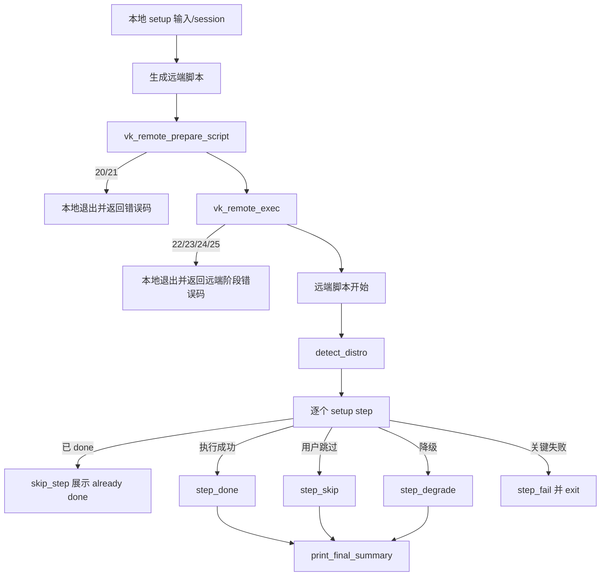

# setup-hardening-pass design

## 0. 术语约定

| 术语 | 定义 | 防冲突结论 |
|---|---|---|
| setup-hardening | `setup.sh` 中远端 VPS 初始化与安全加固步骤，覆盖 SSH、firewall、fail2ban、Docker、Caddy、auto-update、MOTD | roadmap 已定义该模块 |
| setup step event | 写入 `/root/.vpskit-progress` 的事件行：`timestamp|step_id|status|code|message` | 来自 runtime step 契约；当前 setup 只写 legacy 单行 step id |
| hardening summary | 远端 setup 结束时展示每个组件的真实状态，必须区分 done/skipped/failed/degraded | 当前最终摘要固定打印所有项 `[OK]` |
| degraded setup step | 非关键动作失败但主 setup 可继续，例如 Docker log rotation 重启失败；最终摘要必须显示 warning | 当前部分路径使用 `|| true` 静默吞掉 |
| remote setup execution | `setup.sh` 本地生成远端脚本后上传执行的链路 | 必须消费 `lib/remote_exec.sh` |

## 1. 决策与约束

### 需求摘要

本 feature 的用户目标是让服务器初始化/加固流程不再“看起来成功但实际失败或跳过”。本次先聚焦 `setup.sh`：

- `setup.sh` 使用 `lib/remote_exec.sh` 执行远端脚本，获得 `20-25` 分阶段远端错误码。
- 远端 setup 步骤写入事件格式进度，兼容旧 `step1` 单行进度。
- 每个被执行的关键步骤失败要记录 `failed` 并退出，不允许继续打印全 `[OK]`。
- 用户选择不执行某一步时记录 `skipped`，最终摘要不得显示为已完成。
- 可降级动作记录 `degraded`，例如 Docker log rotation 重启失败。
- 中文默认远端注入必须包含继承自英文的 `RMSG_*`，避免 `zh.sh` 只覆盖少量变量导致远端脚本缺变量。

明确不做：

- 不改变 setup 的交互问题清单，不新增/删除加固步骤。
- 不重写 Docker 安装策略；`curl https://get.docker.com | sh` 是否替换留给后续更细的 hardening 决策。
- 不批量改 `security.sh` 或 `status.sh` 的审计规则。
- 不引入真实 VPS 集成测试作为必需前置；本 feature 用脚本抽取/fixture 验证进度协议和远端执行接入。

### 复杂度档位

- 健壮性 = L3 严防。setup 直接修改 SSH/firewall/sudoers/Docker/Caddy，失败必须可诊断。
- 结构 = modules。继续消费 `lib/runtime.sh`、`lib/remote_exec.sh`，不新增根目录 helper。
- 可测试性 = tested。新增测试覆盖 setup 远端脚本的 event progress、skip/degrade/failed 语义、summary 真实性和中文远端注入完整性。
- 安全性 = validated。远端 SSH 加固必须先备份配置、`sshd -t` 通过后再重启，失败要恢复。

### 关键决策

1. setup 远端执行切到共享 wrapper。
   - 选择：`setup.sh` source `lib/runtime.sh` 和 `lib/remote_exec.sh`，使用 `vk_remote_prepare_script` + `vk_remote_exec`。
   - 拒绝：继续 inline `ssh mktemp/scp/ssh "chmod; bash; rm"`。
   - 原因：远端执行错误码和 cleanup 语义已在 `remote-exec-wrapper` 冻结。

2. 远端进度从单行 step id 升级到事件格式。
   - 选择：新增远端 `progress_write/step_is_done/step_done/step_skip/step_fail/step_degrade`。
   - 拒绝：继续只写 `step1`。
   - 原因：只写 done 不能表达失败、跳过或降级，也无法生成真实摘要。

3. 失败不再沉默继续。
   - 选择：关键步骤通过 `run_setup_step` 包装执行，失败记录 `failed` 后退出。
   - 拒绝：依赖 `set -e` 自然中断但不写进度。
   - 原因：用户需要知道停在哪一步、为什么失败、能否恢复。

4. summary 来自进度事件，不再硬编码全 `[OK]`。
   - 选择：每个组件根据最后事件状态显示 `[OK]` / `[WARN]` / `[SKIP]` / `[ERR]`。
   - 拒绝：不管实际执行情况都打印 “Installed”。
   - 原因：用户明确要求异常可检测、可返回，摘要必须可信。

### 前置依赖

- `remote-exec-wrapper` 已完成，提供 `vk_remote_prepare_script` 和 `vk_remote_exec`。
- `zh-i18n-baseline` 已完成，默认语言为中文；本 feature 修正远端注入继承变量缺口。

## 2. 名词与编排

### 2.1 名词层

#### 现状

- `setup.sh` 远端执行仍使用 inline `ssh mktemp`、`scp`、`ssh "chmod 700; sudo bash; rm -f"`。
- 远端脚本 `is_done` 只 grep `^step$`，`mark_done` 只追加 step id。
- 用户不执行某一步时无持久记录；下次运行仍继续询问。
- SSH 加固失败会恢复配置但不写失败事件，也不退出；最终摘要仍可能显示 root disabled。
- Docker log rotation `systemctl restart docker 2>/dev/null || true` 静默吞错。
- 最终摘要固定打印 `[OK]` 用户、SSH key、Root disabled、Firewall、Fail2ban、Docker、Caddy、Git、Auto updates、MOTD。
- `lang/zh.sh` source `en.sh` 获得完整变量，但 `inject_lang_into_remote` 只 grep 物理 `zh.sh`，没有注入继承来的 `RMSG_SETUP_STEP*`。

#### 变化

`setup.sh` 本地侧：

```bash
load_shared_lib "lib/runtime.sh"
load_shared_lib "lib/remote_exec.sh"

vk_remote_prepare_script "$TMPSCRIPT" \
  "__USERNAME__" "$USERNAME" \
  "__SSH_USER__" "$SSH_USER"

vk_remote_exec "$TMPSCRIPT" "$SSH_USER" "$VPS_IP" "$SSH_KEY" "$USE_SUDO" 1800 always
```

`setup.sh` 远端侧：

```bash
progress_write step_id status code message
step_is_done step_id
step_done step_id message
step_skip step_id message
step_fail step_id code message
step_degrade step_id code message
run_setup_step step_id title desc command...
print_final_summary
```

进度事件示例：

```text
2026-06-08T12:00:00+0800|step5|started||Firewall
2026-06-08T12:00:05+0800|step5|done||Firewall enabled
2026-06-08T12:01:00+0800|step6|degraded|docker_restart|Docker log rotation written but restart failed
2026-06-08T12:02:00+0800|step7|skipped||Caddy installation skipped
```

`lang.sh` 远端注入：

```bash
# source 选定语言后，用 compgen + printf '%q' 导出 RMSG_ / LANG_ 当前值
inject_lang_into_remote tmpscript
```

### 2.2 编排层

#### 主流程图



#### 现状

当前 setup 远端脚本依赖 `set -e` 和手写 if 分支；失败时可能直接退出且不写进度，或被 `|| true` 吞掉。最终摘要不读取进度文件，因此不代表真实执行结果。

#### 变化

- 本地远端执行接入 wrapper，远端执行链路失败返回 `20-25`。
- 远端 step helper 负责 started/done/skipped/failed/degraded 事件。
- 每个关键步骤执行失败由 helper 记录 `failed` 并退出。
- SSH hardening 失败走 `step_fail`，恢复配置后退出，避免误报加固成功。
- Docker log rotation 写入成功但 restart 失败走 `step_degrade`，summary 显示 `[WARN]`。
- summary 从进度文件最后事件计算组件状态。

#### 流程级约束

- 错误语义：关键 step 失败必须写 `failed` 并退出；wrapper 阶段失败透传 `20-25`。
- 幂等性：旧单行 `step1` 仍被视为 done；新写入只使用事件格式。
- 顺序约束：只有 step 必需动作成功后写 `done`；skip/degraded 不能被 summary 显示为完整成功。
- 可观测点：进度文件含 step_id、status、code、message；summary 打印每个组件的真实最后状态。
- 扩展点：后续 `security.sh` 可读取 event progress 辅助审计，但本 feature 不改 security audit。

### 2.3 挂载点清单

- `setup.sh` 本地 shared lib 加载点：删掉后无法消费 wrapper。
- `setup.sh` 本地远端执行块：删掉后 setup 无法获得 `20-25` 分阶段错误码。
- `setup.sh` 远端 progress helpers：删掉后 setup 无法表达 failed/skipped/degraded。
- `setup.sh` final summary：删掉后用户无法看到真实加固结果。
- `lang.sh` 远端注入导出逻辑：删掉后中文默认远端脚本仍可能缺继承变量。
- `tests/test_setup_hardening.sh`：删掉后无法验证进度协议和 summary 真实性。

### 2.4 推进策略

1. 本地编排接入：让 `setup.sh` source runtime/remote_exec，并用 wrapper 替代 inline 远端执行。
   - 退出信号：grep 不再命中 setup 旧组合式远端执行行，`bash -n setup.sh` 通过。
2. 远端进度节点：实现 event progress helpers，兼容旧单行 done。
   - 退出信号：抽取远端脚本 fixture 可验证旧 `step1` 和新 `done` 都被识别。
3. 步骤失败/跳过/降级节点：关键步骤通过 helper 记录 started/done/skipped/failed/degraded。
   - 退出信号：fixture 能触发 failed/skipped/degraded 并看到事件行。
4. final summary 节点：从进度事件渲染真实 `[OK]/[WARN]/[SKIP]/[ERR]`。
   - 退出信号：fixture 中 skipped/degraded 不显示为 `[OK]`。
5. 中文远端注入补齐：`inject_lang_into_remote` 导出 source 后的 `RMSG_` / `LANG_` 变量。
   - 退出信号：`VPSKIT_LANG=zh` 注入远端脚本后包含继承的 `RMSG_SETUP_STEP1_TITLE`。
6. 验收覆盖：新增 setup hardening 测试并跑现有 runtime/i18n/remote-exec 测试。
   - 退出信号：新增测试、既有测试、全量 `bash -n` 和 YAML 校验通过。

### 2.5 结构健康度与微重构

##### 评估

- 文件级 — `setup.sh`：约 960 行，职责偏重。本 feature 必须修改远端 setup script 内多处 step 编排；但拆分远端脚本到新文件会影响 curl-mode 单文件下载和现有生成方式，风险大。
- 文件级 — `lang.sh`：约 170 行，注入逻辑集中，修改点清晰。
- 目录级 — `lib/`：已有 runtime/remote_exec；本 feature 不新增新模块。
- compound convention 检索：`.codestable/compound` 暂无目录/命名约定类文档。

##### 结论：不做微重构

本次不拆 `setup.sh`。原因：远端脚本当前以内嵌 heredoc 生成，拆分会改变 curl-mode 分发结构，超出本 feature 的可靠性目标。实现时只在现有 heredoc 内重组 helper 和 step 调用。

##### 超出范围的观察

- `setup.sh` 本地交互仍有多个 `read -p`，后续可走单独 feature 迁移到 runtime input helper。
- Docker 安装方式是否保留 `get.docker.com` 需要后续安全决策，不在本 feature 内替换。

## 3. 验收契约

- S1：`setup.sh` 本地远端执行使用 `vk_remote_prepare_script` 和 `vk_remote_exec`，不再保留旧组合式 `chmod; sudo bash; rm -f`。
- S2：远端进度文件新写入事件格式，旧单行 `step1` 仍被 `step_is_done` 视为 done。
- S3：用户跳过 step 时写入 `skipped`，final summary 显示 `[SKIP]` 而非 `[OK]`。
- S4：关键 step 失败时写入 `failed`，返回非零，不继续打印完整成功摘要。
- S5：Docker log rotation restart 失败时写入 `degraded`，final summary 显示 `[WARN]`。
- S6：SSH hardening 配置校验失败时恢复备份、写入 `failed`，不标记 step4 done。
- S7：final summary 从进度事件渲染，skipped/degraded/failed 不显示为全成功。
- S8：`VPSKIT_LANG=zh` 的远端注入包含继承自英文的 `RMSG_SETUP_STEP1_TITLE` 等 setup 远端变量。

反向核对项：

- 不新增或删除 setup 加固步骤。
- 不替换 Docker 安装策略。
- 不改 `security.sh` 或 `status.sh` 审计规则。
- 不要求真实 VPS 集成测试。

## 4. 与项目级架构文档的关系

验收时需要更新 `.codestable/architecture/ARCHITECTURE.md`：

- `setup.sh` 模块描述补充：已消费 `lib/remote_exec.sh`。
- Progress files 约束补充：setup 已写事件格式并兼容 legacy 单行。
- Known constraints 补充：setup summary 必须从最后 step event 渲染，不能硬编码全 `[OK]`。
