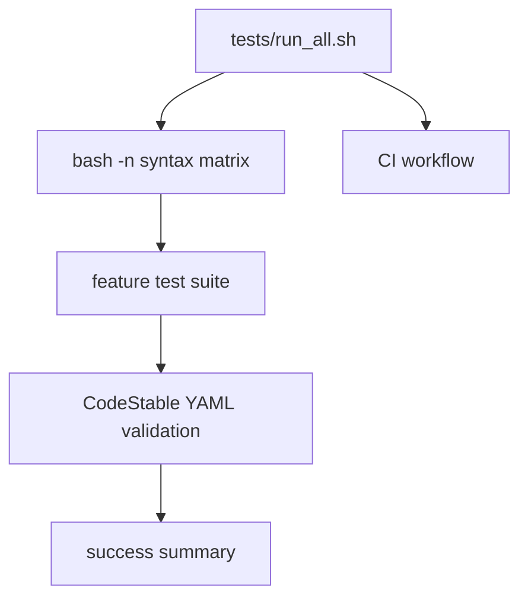

# verification-harness design

## 0. 术语约定

| 术语 | 定义 | 防冲突结论 |
|---|---|---|
| verification harness | 项目内统一测试入口，执行语法、feature tests 和 CodeStable YAML 校验 | roadmap 已定义 verification 模块 |
| syntax matrix | 所有顶层脚本、共享 lib、语言文件和 tests 的 `bash -n` 列表 | 现有 CI 只覆盖部分顶层脚本 |
| feature test suite | `tests/test_*.sh` 中的 runtime/i18n/remote/setup/deploy/ops 测试 | 已存在分散测试 |
| optional lint | ShellCheck 这类环境可能缺失的校验 | CI 保留，local harness 可选 |

## 1. 决策与约束

### 需求摘要

本 feature 把前面 roadmap feature 产生的验证命令收敛成统一入口：

- 新增 `tests/run_all.sh`，串联 syntax matrix、feature test suite、CodeStable YAML 校验。
- CI 的语法/测试步骤改为调用 `tests/run_all.sh`，ShellCheck step 保留。
- `tests/run_all.sh` 输出清晰 `[RUN]/[OK]` 分段，失败立即返回非零。
- YAML 校验覆盖 roadmap items 和所有 feature checklist/contracts。
- README 或架构文档记录新的验证入口。

明确不做：

- 不引入真实 VPS、真实 S3、真实 GitHub SSH 的集成测试硬依赖。
- 不要求本地必须安装 ShellCheck；CI 继续使用 action-shellcheck。
- 不把现有测试改成 Bats/Python/Makefile。
- 不修复 ShellCheck warning；若 CI 现有 warning 存在，保留为独立后续问题。

### 复杂度档位

- 健壮性 = L2/L3 之间。harness 本身简单，但它守住所有 workflow feature 的回归边界。
- 结构 = scripts。新增 `tests/run_all.sh`，不新建测试框架。
- 可测试性 = tested。harness 自身通过运行全套测试证明。
- 安全性 = default。无新远端执行。

### 关键决策

1. 使用 shell harness，不引入 Makefile。
   - 原因：项目是 Bash 工具，CI 已是 shell 命令，最小改动。

2. ShellCheck 保持 CI 独立 step。
   - 原因：本地环境不一定有 shellcheck；harness 不能因此不可用。

3. YAML 校验走 `.codestable/tools/validate-yaml.py`。
   - 原因：CodeStable 产物已经依赖该工具，避免新增 Python 包依赖。

## 2. 名词与编排

### 2.1 名词层

#### 现状

- `.github/workflows/shellcheck.yml` 只跑顶层 `bash -n`，没有跑 `tests/*.sh`、`lib/*.sh`、`lang/*.sh`。
- 已有测试分散在 `tests/test_runtime.sh`、`tests/test_i18n_zh.sh`、`tests/test_remote_exec.sh`、`tests/test_setup_hardening.sh`、`tests/test_deploy_reliability.sh`、`tests/test_ops_flow_reliability.sh`。
- CodeStable YAML 校验只在人工验收命令中运行，没有统一入口。

#### 变化

新增 `tests/run_all.sh`：

```bash
bash tests/run_all.sh
```

执行顺序：

```text
syntax matrix -> feature tests -> CodeStable YAML validation
```

### 2.2 编排层



#### 现状

验证命令散落在 acceptance 文档和手动执行记录中，CI 不知道新增测试。新增测试如果不被手动执行，后续 PR 可能只通过 `bash -n`。

#### 变化

- `tests/run_all.sh` 定义唯一项目级验证入口。
- `.github/workflows/shellcheck.yml` 的“Vérification syntaxe”步骤改为运行 `bash tests/run_all.sh`。
- ShellCheck action 保留为独立 lint。
- architecture Verification Surface 改为记录 harness。

#### 流程级约束

- harness 不联网，不访问真实 VPS/S3。
- harness 失败即整体失败；不吞任何测试返回码。
- YAML 校验工具不存在或目标文件缺失时应失败。
- ShellCheck 不属于 harness 必需项。

### 2.3 挂载点清单

- `tests/run_all.sh`：删掉后统一验证入口消失。
- `.github/workflows/shellcheck.yml` 调用 harness：删掉后 CI 不跑 feature tests。
- `.codestable/architecture/ARCHITECTURE.md` Verification Surface：删掉后架构说明与现状不符。
- `verification-harness` acceptance：删掉后 roadmap 验收缺少证据。

### 2.4 推进策略

1. Harness 脚本节点：新增 `tests/run_all.sh`，包含 syntax matrix、feature tests、YAML 校验。
   - 退出信号：`bash tests/run_all.sh` 通过。
2. CI 接入节点：更新 `.github/workflows/shellcheck.yml` 调用 harness，保留 ShellCheck。
   - 退出信号：workflow 文件包含 `bash tests/run_all.sh`。
3. 架构与文档节点：更新 Verification Surface。
   - 退出信号：architecture 指向新 harness。
4. 验收覆盖节点：跑 harness 和 YAML 校验。
   - 退出信号：harness、bash -n、YAML 都通过。

### 2.5 结构健康度与微重构

##### 评估

- 文件级 — `.github/workflows/shellcheck.yml`：小文件，只需替换语法步骤。
- 文件级 — `tests/`：已有多个 shell 测试，新增一个 runner 不需要重组。
- 目录级 — `tests/`：适合放统一入口。
- compound convention 检索：未发现测试组织约定。

##### 结论：不做微重构

不抽公共 assert helper。现有测试重复 assert 函数，但本 feature 目标是入口统一；提取 helper 会牵动所有测试文件，收益不足。

##### 超出范围的观察

- 后续可把重复 assertion 函数提取到 `tests/testlib.sh`。
- ShellCheck warning 修复适合独立 hardening/refactor。

## 3. 验收契约

- S1：`bash tests/run_all.sh` 执行 syntax matrix、所有 `tests/test_*.sh` 和 CodeStable YAML 校验。
- S2：CI workflow 调用 `bash tests/run_all.sh`。
- S3：ShellCheck action 保留，不作为本地 harness 必需项。
- S4：harness 不访问真实 VPS/S3/GitHub SSH。
- S5：architecture Verification Surface 指向新 harness。

## 4. 与项目级架构文档的关系

验收时更新 `.codestable/architecture/ARCHITECTURE.md`：

- Verification Surface 从手写 `bash -n` 列表更新为 `bash tests/run_all.sh`。
- 说明 ShellCheck 是 CI 独立 lint，harness 覆盖语法、feature tests、YAML。
