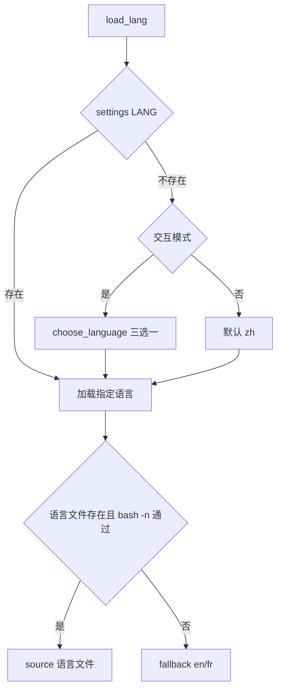

# zh-i18n-baseline design

## 0. 术语约定

- `zh`：中文语言代码，新增 `lang/zh.sh`。
- 中文优先：无用户配置时，交互和非交互默认都使用中文。
- fallback：中文语言包必须有完整变量覆盖；未覆盖的文案先继承英文，避免缺变量导致脚本中断。

## 1. 决策与约束

需求摘要：把 vpskit 的默认用户体验切换为中文，提供中文语言包，并保留英文/法语 fallback。

明确不做：

- 不在本 feature 中人工完整翻译全部 823 条文案。
- 不删除 `lang/en.sh` 或 `lang/fr.sh`。
- 不改业务流程。

复杂度档位：健壮性 L3，结构 modules，可测试性 tested。原因是语言文件被所有脚本 source，缺变量会直接破坏运行。

关键决策：

- `lang/zh.sh` 先 source `en.sh` 后覆盖核心中文变量，保证变量完整性。
- `lang.sh` 默认语言从 `fr` 改为 `zh`。
- 语言选择菜单增加中文选项，并保持 `fr/en` 可选。

## 2. 名词与编排

### 2.1 名词层

现状：`lang.sh` 支持 `fr` 和 `en`，默认 fallback 到 `fr`；`settings.sh` 的语言切换只展示法语/英语。

变化：新增 `lang/zh.sh`，`LANG_CODE=zh`，覆盖 vpskit 入口、设置、部署、状态、安全、备份的核心交互文案；`lang.sh` 无配置时默认 `zh`；`settings.sh` 支持 zh/fr/en 三选一。

### 2.2 编排层

流程级约束：语言文件必须 `bash -n` 通过；`zh.sh` 通过 source `en.sh` 保证变量覆盖；远端注入仍只注入 `RMSG_` / `LANG_`。

### 2.3 挂载点清单

- `lang/zh.sh`：新增中文语言文件。
- `lang.sh`：默认语言和语言选择菜单新增 zh。
- `settings.sh`：语言设置菜单新增 zh。

### 2.4 推进策略

1. 新增 `lang/zh.sh`，继承英文并覆盖核心中文变量。
2. 修改 `lang.sh` 默认语言与选择菜单。
3. 修改 `settings.sh` 语言设置支持 zh。
4. 增加测试，校验 zh 变量覆盖、语法和默认菜单中文。

### 2.5 结构健康度与微重构

本 feature 不做微重构。`lang/` 目录已有 en/fr 两个语言文件，新增 zh 是既有结构的自然扩展；`lang.sh` 和 `settings.sh` 只做局部语言选择逻辑调整。

## 3. 验收契约

- 无配置、非交互 source `lang.sh` 时，`VPSKIT_LANG_CODE=zh`。
- `lang/zh.sh` `bash -n` 通过。
- `lang/zh.sh` 提供与 `lang/en.sh` 同等数量的 `MSG_` / `RMSG_` / `LANG_` 变量。
- `VPSKIT_LANG=zh bash vpskit.sh` 菜单显示中文核心文案。
- `settings.sh` 语言切换菜单包含中文、法语、英语。

## 4. 与项目级架构文档的关系

acceptance 阶段应把 `zh` 语言和中文优先默认行为回写到 architecture。
